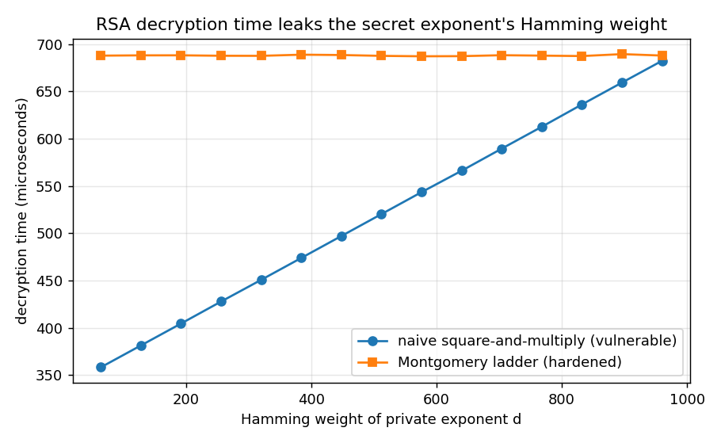

# Remote Timing Analysis of an RSA Decryption Oracle over TCP: Attack and Mitigation

## Overview

This project is an experimental study of a timing side channel in RSA
decryption. It shows, through direct measurement, that the running time of a
naive modular exponentiation depends on the Hamming weight of the private
exponent, and that this dependence is an exploitable information leak. It then
evaluates two mitigations — a Montgomery ladder and multiplicative base
blinding — and demonstrates that, applied together, they make the observed
timing independent of the secret key.

Measurements are taken in two settings: a controlled local benchmark that
isolates each leak, and a client–server configuration that probes the same
decryption oracle over TCP.

## Scope and ethical considerations

All experiments run against a local server bound to `127.0.0.1`, using key
material generated by the project itself. The work exists only to illustrate the
value of constant-time arithmetic and operand blinding. Timing analysis should
be conducted solely against systems that one owns or is explicitly authorised to
test.

## Threat model and mechanism

RSA decryption computes `m = c^d mod n`, where the private exponent `d` is
secret. The time required to evaluate this expression depends on the algorithm
chosen for modular exponentiation.

### Exponent-dependent leak

Left-to-right square-and-multiply processes the exponent one bit at a time,
performing a squaring at every bit and an additional multiplication only when
the current bit is set. The total number of modular multiplications is therefore
`L + HW(d)`, where `L` is the bit length of the exponent and `HW(d)` its Hamming
weight. The squarings are fixed in number and the multiplications are not, so the
execution time is an affine function of `HW(d)` and discloses partial information
about the private key.

A Montgomery ladder performs exactly one squaring and one multiplication per
exponent bit, regardless of its value. The operation count becomes independent of
`d`, and the Hamming-weight leak is removed.

### Input-dependent leak

Montgomery modular multiplication ends with a conditional subtraction — the
"extra reduction" — that executes only when the intermediate result is not less
than the modulus. Whether this branch is taken depends on the operands, so the
number of extra reductions across a full exponentiation varies with the
ciphertext. This input-dependent variation is the signal exploited by
chosen-ciphertext timing attacks that recover the factorisation of `n`. The
project instruments the count in `modexp_montgomery` so that the dependence is
directly observable; the full bit-recovery procedure is left as an extension.

### Mitigation by blinding

The ladder addresses only the exponent-shaped leak. A chosen-ciphertext attack
operates on the input instead. Multiplicative base blinding closes this avenue:
before decrypting `c`, a random `r` is drawn, `c * r^e mod n` is decrypted, and
the result is multiplied by `r^-1 mod n`. The exponentiation then operates on a
randomised value, so its timing carries no information about the true ciphertext.
`rsa_decrypt_secure` combines the ladder with blinding.

## Methodology

Two measurement hazards were controlled for:

- **Scheduling jitter is one-sided.** An anomalously slow sample reflects
  contention for the CPU, not slower computation. The minimum round-trip time
  over many repetitions is therefore used as the estimator of true compute time,
  rather than the mean.
- **Frequency scaling introduces drift.** Gradual changes in CPU frequency can
  manufacture an apparent trend across a block of measurements. In the local
  benchmark the two implementations are timed round-robin, so any drift affects
  both equally and cancels in the comparison.

## Results

Naive square-and-multiply performs one additional modular multiplication per set
bit of `d`, so its runtime is linear in `HW(d)`. The ladder performs identical
work per bit, so its runtime is flat.



1024-bit key, from `./bench hamming`:

| implementation | time vs. Hamming weight of `d` | key-dependent? |
| --- | --- | --- |
| naive square-and-multiply | linear, ≈ 0.36 µs per set bit | yes |
| Montgomery ladder | flat (± 1 µs across the sweep) | no |

Over TCP, probing both oracles with min-filtered round-trip latency
(`./client`) separates them cleanly:

| oracle (identical key) | minimum RTT |
| --- | --- |
| `--vulnerable` (naive, no blinding) | ≈ 620 µs |
| `--secure` (ladder + blinding) | ≈ 840 µs |

`./bench reduction` demonstrates the input-dependent leak: for a fixed key, the
number of Montgomery extra reductions — and the corresponding time — varies with
the ciphertext.

Further discussion of the how and why is in [`docs/NOTES.md`](docs/NOTES.md).

## Repository structure

```
include/   public headers (rsa.hpp, net.hpp)
src/       library: RSA and exponentiation variants, TCP helpers
apps/      server (oracle), client (timing probe), bench (local experiments)
tests/     correctness checks against GMP's mpz_powm
scripts/   run_demo.sh, plot.py
docs/      NOTES.md, result figure
```

`make` compiles `src/` into a small static library and links each application
against it.

## Build

Requires a C++17 compiler and GMP (LGPL).

```bash
# Debian/Ubuntu:  sudo apt-get install build-essential libgmp-dev
make          # builds bench, server, client
make test     # correctness checks
```

## Reproduction

```bash
# full sequence:
./scripts/run_demo.sh

# individual steps:
./bench hamming   300 > hamming.csv
./bench reduction  60 > reduction.csv
python3 scripts/plot.py hamming.csv        # optional, requires matplotlib

# remote oracle, in two terminals:
./server --port 9000 --bits 1024 --seed 4 --vulnerable
./client --port 9000 --reps 3000
#   then restart the server with --secure and compare the minimum RTT
```

The server reports `HW(d)` at startup only so that a recovered estimate can be
checked against ground truth; a real target would not disclose this.

## Limitations

- The RSA implementation is textbook: no padding, no CRT, and deliberately small
  keys. It is unsuitable for any production use.
- The clean Hamming-weight relationship is obtained from the controlled local
  run. Over TCP the project demonstrates a vulnerable-versus-secure
  distinguisher, which is stable; recovering `HW(d)` across random keys purely
  over the network is marginal, because the natural timing variation is small
  relative to cross-process drift.
- Constant *work* (the ladder) is not equivalent to constant *time* with respect
  to cache and branch-prediction channels. This study addresses the
  arithmetic-level leak only, not every microarchitectural one.

## Future work

The Montgomery instrumentation needed for the next step is already in place. The
natural extension is the chosen-ciphertext bit-recovery loop that walks a
selected ciphertext toward a factor of `n` using the extra-reduction timing. The
counter and the input-dependent signal it consumes are implemented; the search
procedure is the remaining component.
